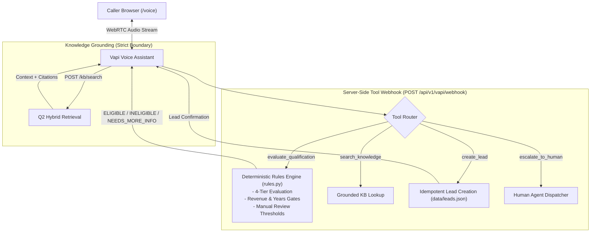

# Q1 Voice Agent Architecture

```mermaid
flowchart TD
    CallerBrowser["Caller Browser (/voice)"] <-->|WebRTC Audio Stream| VapiCore["Vapi Voice Assistant"]

    subgraph GroundingBoundary["Knowledge Grounding (Strict Boundary)"]
        VapiCore -->|POST /kb/search| Q2Search["Q2 Hybrid Retrieval"]
        Q2Search -->|Context + Citations| VapiCore
    end

    subgraph ToolDispatch["Server-Side Tool Webhook (POST /api/v1/vapi/webhook)"]
        VapiCore --> ToolRouter{"Tool Router"}
        
        ToolRouter -->|evaluate_qualification| RulesEngine["Deterministic Rules Engine (rules.py)<br/>- 4-Tier Evaluation<br/>- Revenue & Years Gates<br/>- Manual Review Thresholds"]
        
        ToolRouter -->|search_knowledge| KBTool["Grounded KB Lookup"]
        ToolRouter -->|create_lead| LeadService["Idempotent Lead Creation (data/leads.json)"]
        ToolRouter -->|escalate_to_human| Escalation["Human Agent Dispatcher"]
    end

    RulesEngine -->|ELIGIBLE / INELIGIBLE / NEEDS_MORE_INFO| VapiCore
    LeadService -->|Lead Confirmation| VapiCore
```
