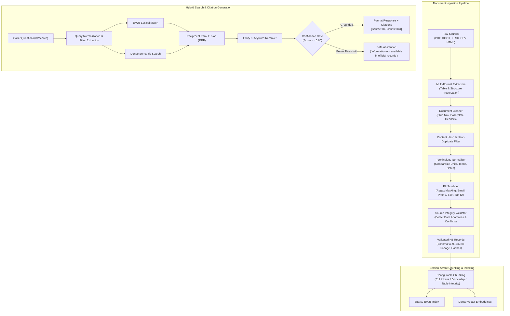

# Q2 Knowledge Base Pipeline & Retrieval Architecture

```mermaid
flowchart TD
    subgraph Ingestion["Document Ingestion Pipeline"]
        Raw["Raw Sources<br/>(PDF, DOCX, XLSX, CSV, HTML)"] --> Loaders["Multi-Format Extractors<br/>(Table & Structure Preservation)"]
        Loaders --> Cleaner["Document Cleaner<br/>(Strip Nav, Boilerplate, Headers)"]
        Cleaner --> Dedup["Content Hash & Near-Duplicate Filter"]
        Dedup --> Terminology["Terminology Normalizer<br/>(Standardize Units, Terms, Dates)"]
        Terminology --> PII["PII Scrubber<br/>(Regex Masking: Email, Phone, SSN, Tax ID)"]
        PII --> Validator["Source Integrity Validator<br/>(Detect Date Anomalies & Conflicts)"]
        Validator --> SchemaRecords["Validated KB Records<br/>(Schema v1.0, Source Lineage, Hashes)"]
    end

    subgraph Indexing["Section-Aware Chunking & Indexing"]
        SchemaRecords --> Chunking["Configurable Chunking<br/>(512 tokens / 64 overlap / Table integrity)"]
        Chunking --> BM25["Sparse BM25 Index"]
        Chunking --> Vectors["Dense Vector Embeddings"]
    end

    subgraph Retrieval["Hybrid Search & Citation Generation"]
        Query["Caller Question (/kb/search)"] --> QueryNormalize["Query Normalization & Filter Extraction"]
        QueryNormalize --> BM25Search["BM25 Lexical Match"]
        QueryNormalize --> DenseSearch["Dense Semantic Search"]
        BM25Search --> Fusion["Reciprocal Rank Fusion (RRF)"]
        DenseSearch --> Fusion
        Fusion --> EntityRerank["Entity & Keyword Reranker"]
        EntityRerank --> Gate{"Confidence Gate<br/>(Score >= 0.60)"}
        Gate -->|Grounded| FormatAnswer["Format Response + Citations<br/>[Source: ID, Chunk: IDX]"]
        Gate -->|Below Threshold| Fallback["Safe Abstention<br/>('Information not available in official records')"]
    end
```
