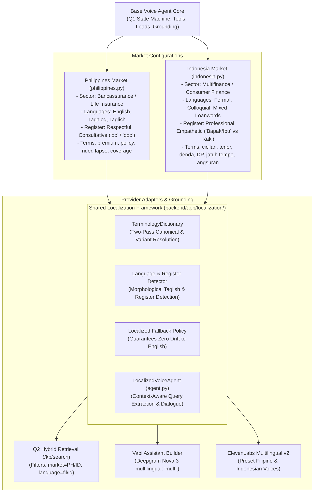

# Q3 Localized Voice Agent Architecture

```mermaid
flowchart TD
    BaseCore["Base Voice Agent Core<br/>(Q1 State Machine, Tools, Leads, Grounding)"]

    subgraph Markets["Market Configurations"]
        PH["Philippines Market (philippines.py)<br/>- Sector: Bancassurance / Life Insurance<br/>- Languages: English, Tagalog, Taglish<br/>- Register: Respectful Consultative ('po' / 'opo')<br/>- Terms: premium, policy, rider, lapse, coverage"]
        
        ID["Indonesia Market (indonesia.py)<br/>- Sector: Multifinance / Consumer Finance<br/>- Languages: Formal, Colloquial, Mixed Loanwords<br/>- Register: Professional Empathetic ('Bapak/Ibu' vs 'Kak')<br/>- Terms: cicilan, tenor, denda, DP, jatuh tempo, angsuran"]
    end

    BaseCore --> PH
    BaseCore --> ID

    subgraph LocalizationCore["Shared Localization Framework (backend/app/localization/)"]
        TermDict["TerminologyDictionary<br/>(Two-Pass Canonical & Variant Resolution)"]
        LangDetect["Language & Register Detector<br/>(Morphological Taglish & Register Detection)"]
        FallbackPol["Localized Fallback Policy<br/>(Guarantees Zero Drift to English)"]
        LocAgent["LocalizedVoiceAgent (agent.py)<br/>(Context-Aware Query Extraction & Dialogue)"]
    end

    PH --> LocalizationCore
    ID --> LocalizationCore

    subgraph IntegrationLayer["Provider Adapters & Grounding"]
        LocalizationCore --> Q2KB["Q2 Hybrid Retrieval (/kb/search)<br/>(Filters: market=PH/ID, language=fil/id)"]
        LocalizationCore --> VapiAssistant["Vapi Assistant Builder<br/>(Deepgram Nova 3 multilingual: 'multi')"]
        LocalizationCore --> TTSVoice["ElevenLabs Multilingual v2<br/>(Preset Filipino & Indonesian Voices)"]
    end
```
