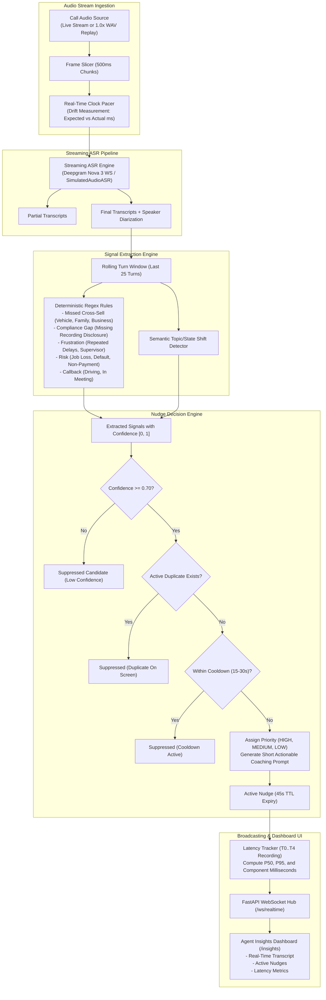

# Q4 Real-Time Call Intelligence & Nudge Architecture

```mermaid
flowchart TD
    subgraph AudioIngest["Audio Stream Ingestion"]
        AudioSource["Call Audio Source<br/>(Live Stream or 1.0x WAV Replay)"] --> Slicer["Frame Slicer (500ms Chunks)"]
        Slicer --> Clock["Real-Time Clock Pacer<br/>(Drift Measurement: Expected vs Actual ms)"]
    end

    subgraph ASR["Streaming ASR Pipeline"]
        Clock --> ASRBridge["Streaming ASR Engine<br/>(Deepgram Nova 3 WS / SimulatedAudioASR)"]
        ASRBridge --> Partials["Partial Transcripts"]
        ASRBridge --> Finals["Final Transcripts + Speaker Diarization"]
    end

    subgraph Signals["Signal Extraction Engine"]
        Finals --> RollingContext["Rolling Turn Window (Last 25 Turns)"]
        RollingContext --> DeterministicRules["Deterministic Regex Rules<br/>- Missed Cross-Sell (Vehicle, Family, Business)<br/>- Compliance Gap (Missing Recording Disclosure)<br/>- Frustration (Repeated Delays, Supervisor)<br/>- Risk (Job Loss, Default, Non-Payment)<br/>- Callback (Driving, In Meeting)"]
        RollingContext --> SemanticState["Semantic Topic/State Shift Detector"]
    end

    subgraph NudgeDecisions["Nudge Decision Engine"]
        DeterministicRules --> SignalsOut["Extracted Signals with Confidence [0, 1]"]
        SemanticState --> SignalsOut
        
        SignalsOut --> ConfGate{"Confidence >= 0.70?"}
        ConfGate -->|No| SuppressLog["Suppressed Candidate (Low Confidence)"]
        ConfGate -->|Yes| DupCheck{"Active Duplicate Exists?"}
        DupCheck -->|Yes| SuppressDup["Suppressed (Duplicate On Screen)"]
        DupCheck -->|No| CooldownCheck{"Within Cooldown (15-30s)?"}
        CooldownCheck -->|Yes| SuppressCool["Suppressed (Cooldown Active)"]
        CooldownCheck -->|No| PrioritySort["Assign Priority (HIGH, MEDIUM, LOW)<br/>Generate Short Actionable Coaching Prompt"]
        PrioritySort --> ActiveNudge["Active Nudge (45s TTL Expiry)"]
    end

    subgraph Telemetry["Broadcasting & Dashboard UI"]
        ActiveNudge --> LatencyRecord["Latency Tracker (T0..T4 Recording)<br/>Compute P50, P95, and Component Milliseconds"]
        LatencyRecord --> WSBroadcaster["FastAPI WebSocket Hub (/ws/realtime)"]
        WSBroadcaster --> WebDashboard["Agent Insights Dashboard (/insights)<br/>- Real-Time Transcript<br/>- Active Nudges<br/>- Latency Metrics"]
    end
```
