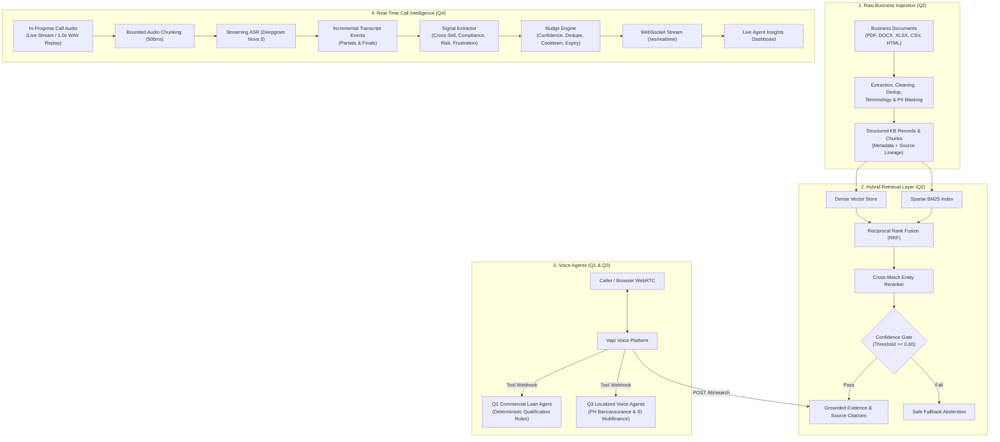

# End-to-End System Architecture

```mermaid
flowchart TD
    subgraph S1["1. Raw Business Ingestion (Q2)"]
        RawDocs["Business Documents<br/>(PDF, DOCX, XLSX, CSV, HTML)"] --> IngestPipeline["Extraction, Cleaning, Dedup,<br/>Terminology & PII Masking"]
        IngestPipeline --> CleanKB["Structured KB Records & Chunks<br/>(Metadata + Source Lineage)"]
    end

    subgraph S2["2. Hybrid Retrieval Layer (Q2)"]
        CleanKB --> SparseIdx["Sparse BM25 Index"]
        CleanKB --> DenseIdx["Dense Vector Store"]
        SparseIdx --> HybridFuse["Reciprocal Rank Fusion (RRF)"]
        DenseIdx --> HybridFuse
        HybridFuse --> Rerank["Cross-Match Entity Reranker"]
        Rerank --> ConfGate{"Confidence Gate<br/>(Threshold >= 0.60)"}
        ConfGate -->|Pass| Citations["Grounded Evidence & Source Citations"]
        ConfGate -->|Fail| SafeAbstain["Safe Fallback Abstention"]
    end

    subgraph S3["3. Voice Agents (Q1 & Q3)"]
        Caller["Caller / Browser WebRTC"] <--> Vapi["Vapi Voice Platform"]
        Vapi -->|POST /kb/search| Citations
        Vapi -->|Tool Webhook| Q1Agent["Q1 Commercial Loan Agent<br/>(Deterministic Qualification Rules)"]
        Vapi -->|Tool Webhook| Q3Agents["Q3 Localized Voice Agents<br/>(PH Bancassurance & ID Multifinance)"]
    end

    subgraph S4["4. Real-Time Call Intelligence (Q4)"]
        CallAudio["In-Progress Call Audio<br/>(Live Stream / 1.0x WAV Replay)"] --> AudioIngest["Bounded Audio Chunking (500ms)"]
        AudioIngest --> StreamingASR["Streaming ASR (Deepgram Nova 3)"]
        StreamingASR --> IncrementalTranscripts["Incremental Transcript Events<br/>(Partials & Finals)"]
        IncrementalTranscripts --> SignalEngine["Signal Extractor<br/>(Cross-Sell, Compliance, Risk, Frustration)"]
        SignalEngine --> NudgeEngine["Nudge Engine<br/>(Confidence, Dedupe, Cooldown, Expiry)"]
        NudgeEngine --> WebSocket["WebSocket Stream (/ws/realtime)"]
        WebSocket --> Dashboard["Live Agent Insights Dashboard"]
    end
```
